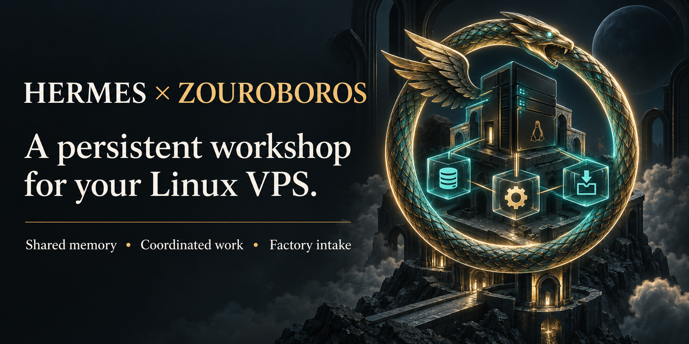
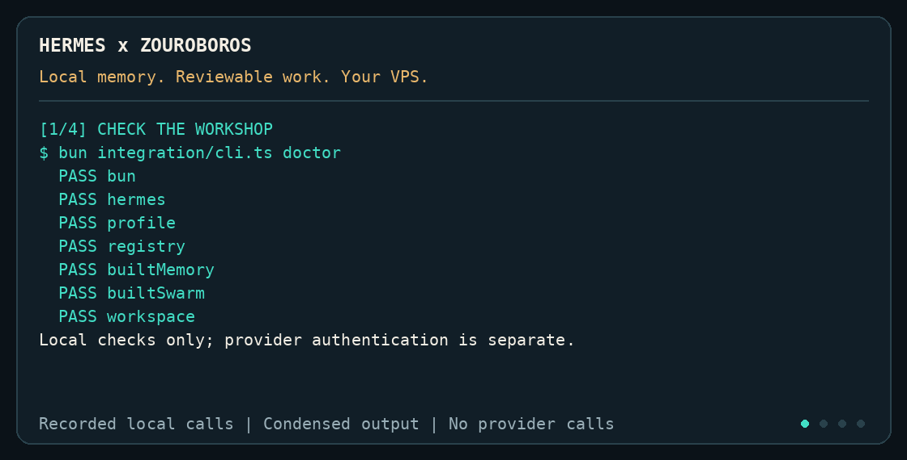
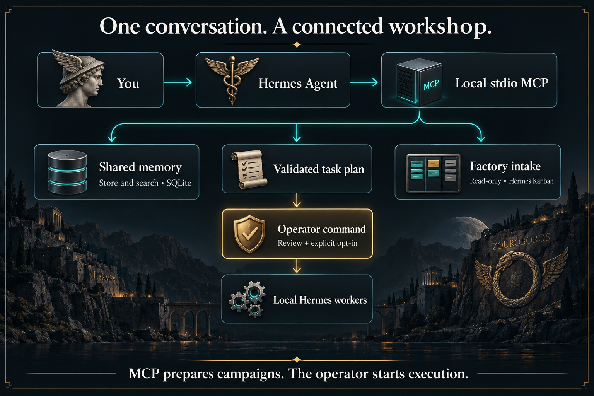
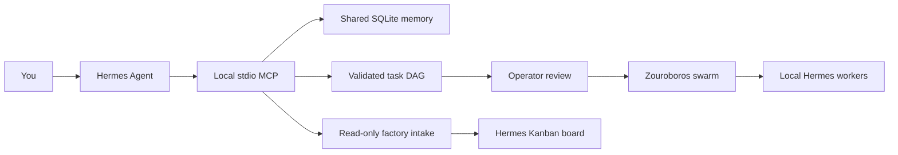
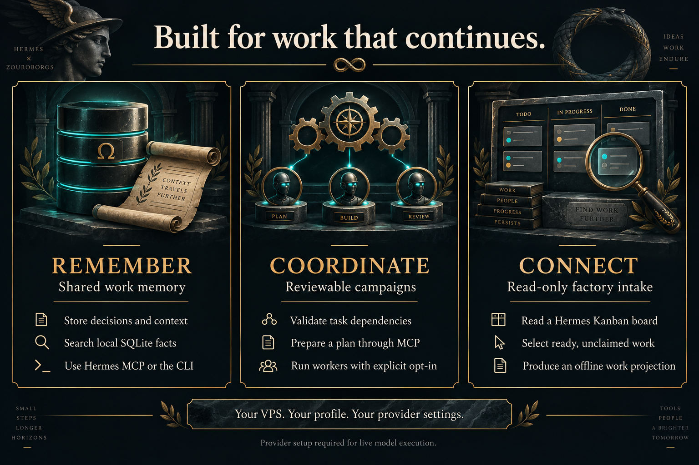

# Hermes × Zouroboros

[](https://github.com/marlandoj/hermes-zouroboros/actions/workflows/ci.yml)
[](#start-here)
[](#release-boundaries)



**A persistent workshop for Hermes Agent, running on your Linux VPS.**

Hermes handles the conversation and tools. Zouroboros supplies shared work memory, task orchestration, and a path into the software factory. This repository brings those pieces together with an isolated Hermes profile, a local MCP connection, and source extracted from the Zouroboros VPS workspace.

It is an independent repository with fresh history. Muse Zouroboros informed the product brief; no Muse code or Git history was used.

## See it work



**24 seconds: check → remember → recall → prepare.** Recorded CLI and MCP calls with condensed output, paced playback, and temporary paths replaced. No provider calls. [Read the transcript](docs/assets/terminal-demo.txt) or [run the demo yourself](docs/demo.md).

## Put it to work

| When you need to… | Try this | What you get |
| --- | --- | --- |
| Resume work with a saved decision | Store “Use copper widgets” through the CLI; ask Hermes to call `memory_search` for `copper` in a later session. | The saved fact from the same local SQLite database. [Memory walkthrough](walkthrough/README.md#3-prove-shared-memory) |
| Coordinate tasks with dependencies | Ask `swarm_prepare` for `inspect` followed by `summarize`, with `summarize` depending on `inspect`. | A validated campaign file to review before explicitly running workers. [Try the example](docs/demo.md#try-the-same-workflow-in-hermes) |
| Inspect the factory's ready work | Connect a qualified Hermes Kanban board and call `factory_intake`. | Ready, unclaimed tickets for planning; reading does not reserve or dispatch them. [Connect a board](docs/factory.md) |

## A connected workshop



<details>
<summary>Explore the architecture as a text diagram</summary>



</details>

## What works in this release



| Capability | Included behavior |
| --- | --- |
| Shared memory | Store/search work facts through Hermes MCP or the CLI; local SQLite, no API key needed for keyword search |
| Swarm | Validate task dependencies, prepare reviewable campaigns, explicitly run bounded local Hermes workers with failure exit codes |
| Hermes integration | Isolated profile, absolute MCP wiring, portable one-shot executor; provider/model configuration stays under operator control |
| Factory intake | Read a qualified Hermes Kanban board, reject schema drift, select ready/unclaimed work; offline deterministic work projection |
| VPS operations | Setup and doctor commands, optional loopback memory-gate systemd template, backup guidance, CI and portable-state verification |
| Source | Nine Zouroboros packages plus the upstream CLI dependency closure, with per-file source hashes |

The default executor is Hermes. The bundled swarm library supports additional harnesses, but adding one requires reviewing its bridge and registry settings for your host. Installation adds the Zouroboros MCP connection to the selected existing normal Hermes profile while preserving unrelated settings; it does not change existing VPS services or other profiles.

## Start here

Prerequisites: a Linux host, Git, Node.js 20+, Bun 1.3.12+, Python 3.10+, GNU coreutils, and an installed/configured Hermes Agent. The installer can bootstrap missing pnpm at the exact source pin into workshop-private tools.

For shared memory and Zouroboros tools in your **normal Hermes chats**:

```bash
git clone https://github.com/marlandoj/hermes-zouroboros.git
cd hermes-zouroboros
bash scripts/install.sh --workspace "$HOME/work/hermes-projects"
```

The installer preserves existing workshop data and unrelated profile settings, connects MCP through the supported Hermes CLI, keeps workers and sampling off, and verifies memory persistence across reconnects. Start a new chat or explicitly use `/reload-mcp`, then ask for `workshop_status`. See [operator installation](docs/install.md) for preview/check modes, profile selection, prerequisites, failure recovery, and capability boundaries.

If you deliberately prefer the separate workshop chat instead, the original setup remains available:

```bash
bash scripts/setup.sh
mkdir -p "$HOME/work/hermes-projects"
bun integration/cli.ts init --workspace "$HOME/work/hermes-projects"
bun integration/cli.ts hermes setup
bun integration/cli.ts doctor
bun integration/cli.ts hermes chat
```

`hermes setup` is interactive. For an unattended setup, pass the model to `init` instead and skip that step: `bun integration/cli.ts init --workspace "$HOME/work/hermes-projects" --model <model-id> [--provider <hermes-provider>]` writes `model.default` (and `model.provider`) into the new profile's `config.yaml`. Provider credentials still come from the environment or a later `hermes auth`/`hermes setup`.

`init` and `doctor` print a one-line notice while `ZOUROBOROS_RESTRICTED_EMAIL_DOMAINS` is unset: until you set it to your comma-separated employer or client mail domains, the public candidate-corpus guard cannot block addresses at those domains (secret and token patterns are checked regardless). See [VPS operation](docs/operations.md#restricted-email-domains).

The workshop's isolated worker profile remains under `~/.local/share/hermes-zouroboros/hermes`; its provider login is separate. Connecting shared-memory tools to a normal profile does not copy credentials or merge session histories. Read the [walkthrough](walkthrough/README.md) for the separate model setup, campaign execution, and factory wiring.

### Recognize your first successful run

After setup and initialization, `bun integration/cli.ts doctor` should exit with code 0 and print:

```json
{
  "ok": true,
  "checks": {
    "bun": true,
    "hermes": true,
    "profile": true,
    "registry": true,
    "builtMemory": true,
    "builtSwarm": true,
    "workspace": true
  },
  "note": "Local prerequisites only; provider authentication and live model execution need an operator smoke test."
}
```

While `ZOUROBOROS_RESTRICTED_EMAIL_DOMAINS` is unset, the output also carries a `notices` entry (and the same line on stderr); it does not affect `ok`.

A `false` check means a local prerequisite needs attention: build with `bash scripts/setup.sh`, install Hermes if `hermes` is false, or check your initialized profile and workspace paths. Doctor verifies the local installation; confirm provider access with `hermes chat` from the commands above.

Prove the local workflow without provider setup:

```bash
bun examples/offline-demo.ts
```

Look for `demo.choice = Use copper widgets`, `Saved 2 tasks: inspect -> summarize`, and `Worker execution enabled: false`. The demo uses a disposable profile and removes it afterward. [What the demo checks](docs/demo.md).

## A first campaign

Review [examples/tasks.json](examples/tasks.json), then explicitly enable local execution:

```bash
HERMES_ZOUROBOROS_ALLOW_SWARM=1 \
  bun integration/cli.ts swarm "$PWD/examples/tasks.json"
```

This invokes your configured model and may incur provider charges. Hermes one-shot mode is unattended and can use shell/file tools in the selected workspace. The opt-in authorizes that work; it is not a sandbox. See [Hermes execution](docs/hermes.md).

MCP prepares campaigns; execution is a separate operator command. A successful worker response is not proof that software is ready to ship. Review changes and run the target project's checks.

## Release boundaries

This is a VPS distribution foundation, not a clone of the production host. Factory intake is included; automatic claiming, production dispatch, specialist review enforcement, deployment, and merge are not installed. See [factory boundaries](docs/factory.md).

The supported entry point is `integration/cli.ts`. The imported packages retain broader upstream APIs; optional legacy CLI skills/TUI and standalone self-healing probes are not bundled. The local worker uses task-schema/DAG validation and post-flight result evaluation. Production-wide seed/gap audits depend on an installation and role inventory this release does not provision. Automatic swarm memory enrichment is off; shared MCP memory is active.

Zouroboros skills are being ported into `skills/`, which the generated profile registers with Hermes. Every file carries provenance and passes a leak gate. [Skills](docs/skills.md) explains the import process, and the [parity manifest](docs/SKILLS-PARITY.md) tracks each source skill.

## Verification and provenance

```bash
pnpm run build
pnpm run typecheck
pnpm test
python3 -m unittest discover -s factory -p 'test_*.py'
pnpm run verify:portable
bun scripts/ci/leak-gate.ts          # needs GITLEAKS_BIN; see docs/skills.md
bun scripts/ci/skills-parity.ts check
```

Tests include a real MCP client handshake, SQLite memory round trip, factory integrity checks, fake-executor campaigns, and relocation of portable state. They do not make paid model calls. See [verification](docs/verification.md), [operations](docs/operations.md), and [source provenance](provenance/workspace.json).

## Licensing

MIT applies to the distribution integration and MIT-licensed source. Two inherited private packages, `@zouroboros/control-plane` and `@zouroboros/capability-runtime`, retain their **UNLICENSED** declarations; the root license does not relicense them. They are included for the upstream CLI dependency closure. Hermes Agent is installed separately and retains its own license. See [NOTICE](NOTICE.md).
