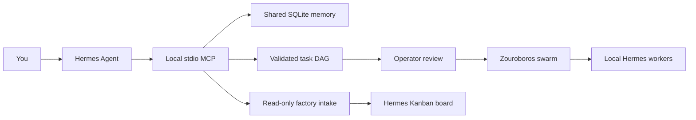

# Hermes × Zouroboros

**A persistent workshop for Hermes Agent, running on your Linux VPS.**

Hermes handles the conversation and tools. Zouroboros supplies shared work memory, task orchestration, and a path into the software factory. This repository brings those pieces together with an isolated Hermes profile, a local MCP connection, and source extracted from the Zouroboros VPS workspace.

It is an independent repository with fresh history. Muse Zouroboros informed the product brief; no Muse code or Git history was used.



## What works in this release

| Capability | Included behavior |
| --- | --- |
| Shared memory | Store/search work facts through Hermes MCP or the CLI; local SQLite, no API key needed for keyword search |
| Swarm | Validate task dependencies, prepare reviewable campaigns, explicitly run bounded local Hermes workers with failure exit codes |
| Hermes integration | Isolated profile, absolute MCP wiring, portable one-shot executor; provider/model configuration stays under operator control |
| Factory intake | Read a qualified Hermes Kanban board, reject schema drift, select ready/unclaimed work; offline deterministic work projection |
| VPS operations | Setup and doctor commands, optional loopback memory-gate systemd template, backup guidance, CI and portable-state verification |
| Source | Nine Zouroboros packages plus the upstream CLI dependency closure, with per-file source hashes |

The default executor is Hermes. The bundled swarm library supports additional harnesses, but adding one requires reviewing its bridge and registry settings for your host. No existing VPS services or profiles are changed by installation.

## Start here

Prerequisites: a Linux host, Git, Node.js 20+, Bun 1.3.12+, pnpm 8.15, Python 3.10+, GNU coreutils, and an installed Hermes Agent.

```bash
git clone https://github.com/marlandoj/hermes-zouroboros.git
cd hermes-zouroboros
bash scripts/setup.sh

mkdir -p "$HOME/work/hermes-projects"
bun integration/cli.ts init --workspace "$HOME/work/hermes-projects"
bun integration/cli.ts hermes setup
bun integration/cli.ts doctor
bun integration/cli.ts hermes chat
```

In Hermes, ask it to call `workshop_status`, then store and retrieve a harmless work decision. The profile's MCP connection exposes `memory_store`, `memory_search`, `swarm_prepare`, and `factory_intake` as well.

Read the [walkthrough](walkthrough/README.md) for model setup, campaign execution, and factory wiring. The installation uses a new profile under `~/.local/share/hermes-zouroboros/hermes`; it does not reuse your existing Hermes login automatically.

## A first campaign

Review [examples/tasks.json](examples/tasks.json), then explicitly enable local execution:

```bash
HERMES_ZOUROBOROS_ALLOW_SWARM=1 \
  bun integration/cli.ts swarm "$PWD/examples/tasks.json"
```

This invokes your configured model and may incur provider charges. Hermes one-shot mode is unattended and can use shell/file tools in the selected workspace. The opt-in authorizes that work; it is not a sandbox. See [Hermes execution](docs/hermes.md).

MCP prepares campaigns; execution is a separate operator command. A successful worker response is not proof that software is ready to ship. Review changes and run the target project's checks.

## Release boundaries

This is a VPS distribution foundation, not a clone of the production host. Factory intake is included; automatic claiming, production dispatch, specialist review enforcement, deployment, and merge are not installed. See [factory boundaries](docs/factory.md).

The supported entry point is `integration/cli.ts`. The imported packages retain broader upstream APIs; optional legacy CLI skills/TUI and standalone self-healing probes are not bundled. The local worker uses task-schema/DAG validation and post-flight result evaluation. Production-wide seed/gap audits depend on an installation and role inventory this release does not provision. Automatic swarm memory enrichment is off; shared MCP memory is active.

## Verification and provenance

```bash
pnpm run build
pnpm run typecheck
pnpm test
python3 -m unittest discover -s factory -p 'test_*.py'
pnpm run verify:portable
```

Tests include a real MCP client handshake, SQLite memory round trip, factory integrity checks, fake-executor campaigns, and relocation of portable state. They do not make paid model calls. See [verification](docs/verification.md), [operations](docs/operations.md), and [source provenance](provenance/workspace.json).

## Licensing

MIT applies to the distribution integration and MIT-licensed source. Two inherited private packages, `@zouroboros/control-plane` and `@zouroboros/capability-runtime`, retain their **UNLICENSED** declarations; the root license does not relicense them. They are included for the upstream CLI dependency closure. Hermes Agent is installed separately and retains its own license. See [NOTICE](NOTICE.md).
