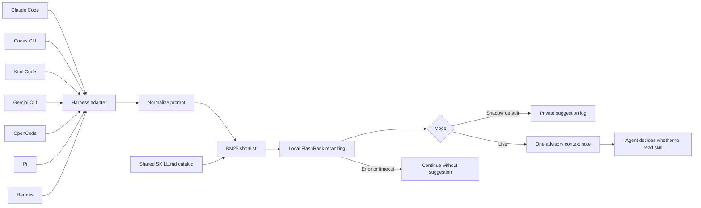
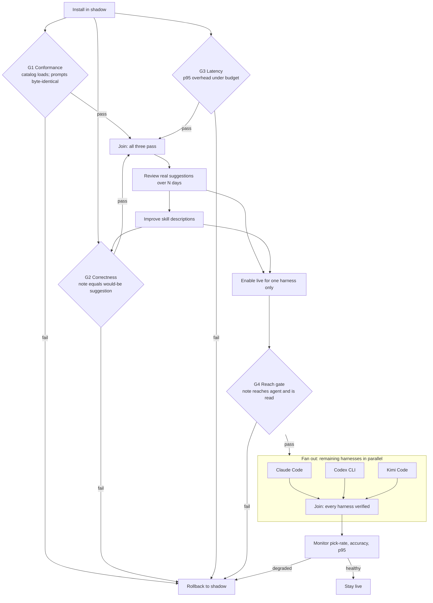

# Wayfinder workflows





### Gate criteria

| Gate | Pass condition | Fail action |
| --- | --- | --- |
| G1 Conformance | Catalog loads from `SKILL.md`; every prompt reaching a harness is byte-identical to the pre-install prompt, compared by digest | Rollback to shadow; do not iterate further |
| G2 Correctness | The live note text equals the shadow suggestion for the same prompt, case for case | Rollback; fix in shadow before any live enablement |
| G3 Latency | p95 prompt-time overhead below the adapter's remaining budget, measured over >=100 prompts | Rollback; ranking must move off the prompt path |
| G4 Reach | The note is present in the agent's received context and was read, on one harness | Return that harness to shadow; do not expand |

### Edge semantics

Two dependencies are load-bearing and were absent from the earlier serial
chain. First, `Improve skill descriptions` must feed `Enable live`: a review
with no improvement pass behind it is not evidence, and the old chain allowed
live enablement after a single review. Second, every live stage has a rollback
edge back to shadow. The old chain terminated in "monitor or switch back",
which is a terminal note, not a transition — a harness that degrades had no
defined path back.

`Expand to other harnesses` is a parallel fan-out with an explicit join, not a
serial chain. Each harness is verified independently; the join is what admits
the fleet-wide live state. One harness failing its G4 returns that harness to
shadow without disturbing the others.

Setup may download the ranking model. Prompt-time ranking cannot download it. Live context is consumed by the harness and its configured provider; Wayfinder itself makes no remote ranking request.

### Gate ordering is executable, not illustrative

The two diagrams above are drawings. The ordering they claim to show is
enforced by `engine/dag.py` against `workflows/adoption.dag.json` and
`workflows/routing.dag.json`, and a spec that does not survive the checker
fails the test suite:

```bash
python3 engine/dag.py validate workflows/routing.dag.json   # exit 0 sound, 2 invalid
python3 engine/dag.py plan     workflows/routing.dag.json   # waves, critical depth
python3 engine/dag.py order    workflows/routing.dag.json   # per-lane waves
```

A spec keeps **two** graphs, and conflating them is the mistake this design
exists to prevent:

- **`deps` — execution edges.** Acyclic by construction, checked by a
  three-colour walk. This is what decomposes into waves. A back edge here
  would destroy wave scheduling for the whole workflow over one rollback path.
- **`transitions` — control edges.** Where a verdict sends the run. Allowed
  to point backwards; `rollback_to_shadow` and the `improve -> G2` re-test
  loop are cycles here and must stay cycles.

`deps` says *what must run first*. `transitions` says *what a gate's verdict
means*. Only the first determines wave membership.

### Runtime gate order

The routing lane is **not** serial, and refusing to flatten it is the point:

```bash
$ python3 engine/dag.py order workflows/routing.dag.json
wave 0: prompt_intake
wave 1: harness_gate  model_route_gate  swarm_decision_gate
wave 2: skills_gate
wave 3: emit_or_skip
```

`harness_gate`, `model_route_gate` and `swarm_decision_gate` are wave-1
siblings because none of them consumes another's output. Only `skills_gate`
has a real predecessor, and it is `harness_gate` alone:

- `harness_gate -> skills_gate` is load-bearing. `catalog.roots_for(harness)`
  returns a **different catalog root set per harness** (`engine/catalog.py`,
  `NATIVE_ROOTS`), so ranking before harness resolution would search the wrong
  catalog. This is the one ordering constraint that is real.
- `model_route_gate` is *not* a predecessor of `skills_gate`. The resolved
  tier shapes how the model **answers**; it does not change which skills are
  **applicable**. Chaining them would serialize two genuinely independent
  decisions.
- `swarm_decision_gate` is *not* a predecessor of `skills_gate` either.
  Orchestration strategy is orthogonal to skill relevance, and when a swarm is
  engaged the skill assessment runs per workstream inside the swarm rather than
  being replaced by that verdict.

So the answer to "skills-before-or-after harness and model-route" is
**after harness, beside model-route** — and beside swarm. `gating_order()`
refuses to answer for any lane containing a multi-node wave rather than
silently picking an order inside the wave, because such an order is not in the
graph.

`swarm_decision_gate` also declares a four-way `verdicts` vocabulary
(`direct`, `suggest`, `swarm`) instead of pass/fail. The checker does not force
two verdicts onto a decision that has four; it requires that every declared
verdict is routed, and that a gate can decide more than one way at all.
